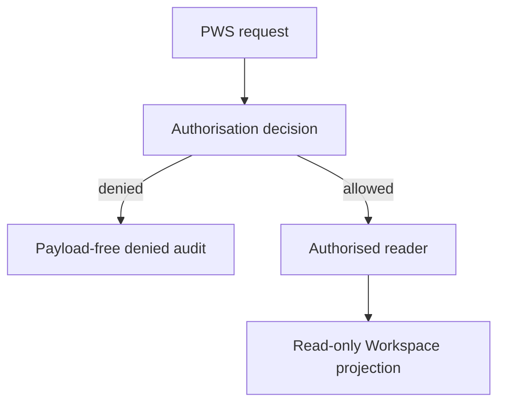

# PWS API Conflict Matrix

Baseline: `main@39c45784994f36630cad62c368149c1cb99e9b13`

No PWS API is activated by W1. The Authorised Data Loader is a server-side
library boundary and calls its supplied reader only after authorisation.

| conflictId | affectedObject | currentPaths | proposedCanonicalPath | legacyHandling | migrationNeed | riskLevel | resolutionStage |
| --- | --- | --- | --- | --- | --- | --- | --- |
| API-001 | Reconstruction API | `functions/api/reconstruct-reality.js`; `reconstruct-runtime.js` | Keep current canonical endpoint decision; deprecate only through a separate API ticket | Both remain unchanged | none | high | audit only |
| API-002 | Reading API | `read-runtime.js`; retired `generate-reading.js` response path | `read-runtime.js` remains canonical formal Reading endpoint | Keep 410/compatibility behavior | none | medium | frozen |
| API-003 | Navigation API | `navigate-runtime.js` plus client modules | Runtime Navigation API owns state; PWS consumes read-only projection | No PWS mutation endpoint | none | critical | frozen |
| API-004 | Book commerce APIs | Book product, checkout, payment status, receipt, access, download and webhook endpoints | Keep book-specific API family | Do not generalize into professional service APIs by naming alone | none in W1 | critical | W2 proposed |
| API-005 | Professional Workspace API | No authoritative API; page receives prevalidated payload/demo | Future API must invoke `authorised-professional-data-loader.js` server-side | Page remains unchanged and inactive | later persistence/auth | critical | W1 library boundary; API later |
| API-006 | Front-end state interpretation | `assets/js/pages/professional-workspace.js` humanizes arbitrary status keys and applies filters | Future API returns canonical display projection plus machine status | Keep current read-only renderer; it must not authorise access | none | high | W2 proposed |
| API-007 | API-created state | Runtime APIs assemble responses and stage state; no generic prohibition at PWS boundary | W1 loader returns data only; mutations require future explicit operations | Existing Runtime APIs unchanged | none | critical | W1 resolved for PWS |
| API-008 | Permission bypass | Direct imports of Workspace projection builders can operate on caller-supplied “validated” Workspace | Real data entrypoint must be W1 loader; projection builders remain internal/Legacy | Keep existing tests and demo use | none | critical | W1 canonical entrypoint |
| API-009 | Payment → Journey | No current generic route, but Book payment status/entitlement could be reused incorrectly | Future Journey activation operation must be separate from payment webhook | Preserve Book One webhook | later commerce model | critical | W2 proposed |
| API-010 | Provider → formal object | Entry/Reading provider routers return stage payloads; consumers could bypass gates | Existing Runtime rule/gate contracts remain canonical; W1 forbids Provider output formalisation | Preserve Provider endpoints and fallback | none | critical | frozen |
| API-011 | Error vocabulary | APIs use HTTP/status-specific strings; security uses coded errors; professional contracts throw `TypeError` | W1 denial code catalog is canonical only for PWS access | Adapt Legacy errors at future API boundary | none | high | W1 resolved locally |
| API-012 | Audit transport | Existing access event builders have no central append endpoint | W1 emits payload-free audit value; future append-only store owns persistence | No network emission in W1 | later persistence | high | W1 contract; W2 store |

## API gate order

The reader is never called on a denied path. W1 creates no route, Function
handler, D1 call, Provider call, payment call, or page behavior.
