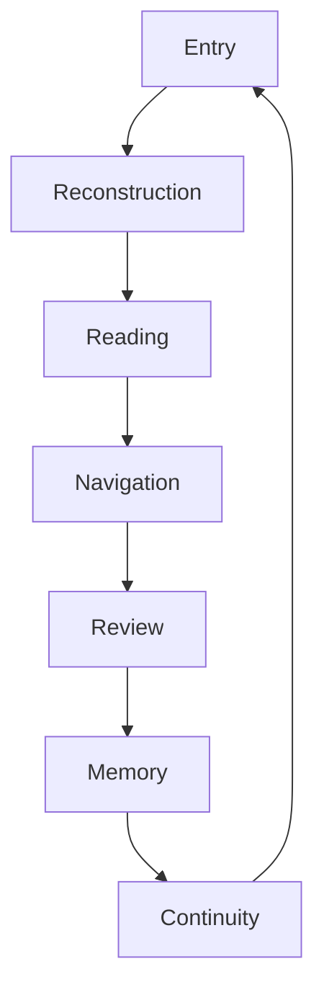
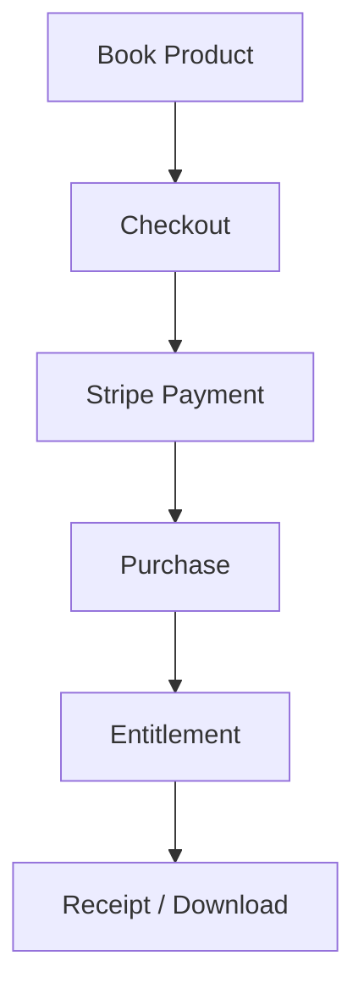
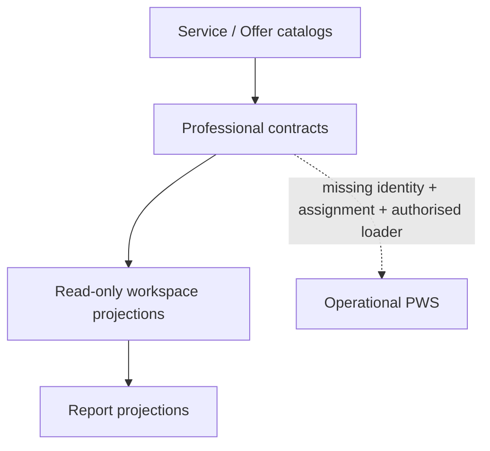

# PWS Current Runtime Map

Baseline: `main@af22a12be4f466dfe4649c1432fa9e4234608a43`

## 1. Active Core Runtime

The seven-stage sequence is frozen in
`content/registry/runtime-modules.json`. Server rules live under
`functions/runtime/<stage>/`; browser orchestration is exposed through
`assets/js/runtime/index.js` and the Runtime Kernel managers.

## 2. Runtime infrastructure

| Layer | Current implementation | Production state |
| --- | --- | --- |
| Contract/schema/version registry | `functions/runtime/registry/` | active |
| Transition/state | Runtime Kernel transition manager and browser transition engine | active |
| Event/timeline | event types, append service, reader, projection, service | active |
| Revision/lineage | revision records, lineage stores, lineage revision service | active |
| Persistence | memory, local and D1 drivers with router/recovery | active/driver-dependent |
| Security/privacy | access boundary, classification, privacy logger/service | active for Runtime |
| Provider routing | Rule Engine, Workers AI and OpenAI routes for Entry/Reading | active/configuration-dependent |
| Provider policy | closed priority, call-boundary and fallback registry | active |
| Provider usage | per-call usage payload in provider results | partial; no ledger or persistence |
| Provider budget | not found | missing |
| API | reconstruct, read, navigate and infrastructure health endpoints | active |
| PWS authorised loader | not found | missing |
| PWS persistence | explicitly disabled | inactive |

## 3. Commerce runtime

This flow is implemented through `functions/commerce/`,
`functions/api/book-one-*.js`, `functions/api/stripe-webhook.js` and the ten
tables in `db/migrations/0004_book_commerce.sql`. It is a Book One knowledge
commerce runtime, not a generic PWS Order/Payment runtime.

`commerce_receipts` is a canonical Book One Receipt store.
`functions/api/book-one-payment-status.js` exposes payment/fulfillment state,
and `functions/api/book-one-receipt.js` exposes a receipt only after verified
book access. Neither is a generic Professional Service Order/Payment/Receipt
runtime.

## 4. Current Professional path

Current Professional capabilities include:

- service, pricing, deliverable, modality and offer registries;
- workspace, client, task, note, revision, navigation-consideration and
  follow-up contracts;
- professional, external-reader and household consent contracts;
- external-reader intake, chart, interpretation and registry contracts;
- financial intake, evidence, calculation, authority, workspace and report
  contracts;
- report version and print/PDF projection contracts;
- professional appointment and payment-record contracts;
- public Professional, Services, Appointment, Consent, Privacy and Reports
  pages.

Operational blockers are explicit in the registries:

- no authenticated PWS loader;
- no real client payload;
- no canonical Professional identity;
- no Assignment object;
- no PWS API;
- no PWS D1 persistence or Professional Notes persistence;
- no enabled professional actions or automatic signing;
- no live professional booking/payment gateway;
- no authoritative professional entitlement.

## 5. Data and responsibility separation

| Data layer | Current status |
| --- | --- |
| Customer original material | active in Runtime/public journey |
| Customer formal record | represented in Runtime persistence |
| Professional working notes | contract/projection only |
| Candidate revision | contract/projection only |
| Formally signed output | requirements only; operation disabled |
| Professional responsibility period | policy-defined; no canonical lifecycle object |

Professional observations and external-reader interpretations remain separate
sources. They cannot become observed Runtime Evidence automatically. Candidate
revisions cannot overwrite the formal Reading without explicit review and
signature.

## 6. State ownership risks

| Risk | Evidence | Required treatment in PWS-ENTRY-W1 |
| --- | --- | --- |
| Migration registry terminology | executable registry JSON has versions 1–4; JS registry contains version-0 schema declarations | preserve both; rename/define roles before any count change |
| Service vs Offer | separate catalogs with overlapping entries | choose canonical identities and references |
| Product vs Service | book Product is operational; professional services are catalogs | do not generalize book tables without contract decision |
| Purchase vs Order | commerce purchases act as completed book orders | introduce/define Order without reclassifying history silently |
| Runtime Workspace vs Professional Workspace | both use “Workspace” but have different authority | maintain separate scopes under one Journey identity |
| Generic Report vs Journey/Specialist reports | report contract contains multiple types | define report identities and composition before release |
| Runtime Capability vs Professional Capability | same word, different meaning | namespace and owner separation |
| Entry/Reading Provider contracts | intentional stage-specific pair | share usage ledger, not output authority |
| Provider result usage / Provider Usage ledger | adapters return token counts, but no durable usage object exists | preserve result metadata; add accounting only under a future authorized contract |
| Adapter token caps / Provider Budget | per-call output limits are technical safeguards, not commercial budgets | do not treat constants as an entitlement or budget |
