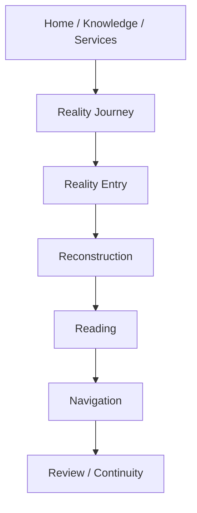
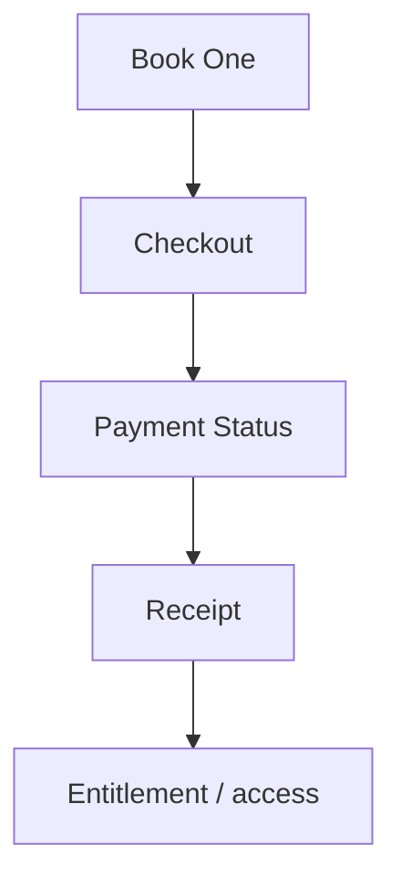

# PJA Current Coverage

Baseline: `main@af22a12be4f466dfe4649c1432fa9e4234608a43`

## 1. Page inventory

| Requested page | Status | productionActive | Canonical/current path | Notes and gaps |
| --- | --- | --- | --- | --- |
| Home | exists | yes | `index.html`, `assets/js/pages/landing.js` | public shell and bilingual content present |
| Knowledge | partial | yes | `explore.html`, `library.html`, `academy.html` | fragmented; no single canonical Knowledge landing |
| Atlas | partial | yes | `figures.html`, `figure.html`, `assets/js/pages/atlas*.js` | figure/atlas logic exists; route naming is split |
| Books | exists | yes | `book-one.html`, preview/reader pages; book registries | Book One active; Books 2–3 registry/asset preparation |
| Articles | missing | no | — | no dedicated page/catalog found |
| Videos | missing | no | — | no dedicated page/catalog found |
| Professional | partial | yes | `professional-boundary.html`; Professional public locale/shell | service boundary content exists; not an operational service entry |
| Services | exists | yes | `services.html` | public catalog; checkout not active for professional services |
| Reality Journey | exists | yes | `reality-journey.html` | public Journey overview |
| Reality Entry | exists | yes | `reality-entry.html`, `assets/js/reality-entry.js` | active adaptive Entry |
| Reconstruction | exists | yes | `reality-reconstruction.html` | active customer projection and evidence layering |
| Reading | exists | yes | `reality-reading.html` | active evidence-bounded Reading |
| Navigation | exists | yes | `reality-navigation.html` | active path selection/execution presentation |
| Review | exists | yes | `reality-review.html` | Review, Memory and Continuity projections present |
| Checkout | partial | conditional | `checkout.html`, Book One checkout API | Book One only; Journey Pass and professional checkout missing |
| Payment Status | exists | conditional | `payment-success.html`, `assets/js/pages/payment-success.js`, `functions/api/book-one-payment-status.js` | deployed Book One payment/fulfillment state; not generic PWS status |
| Account | partial | no | `account.html`, `account-my-reality.html` | live auth and authoritative entitlements disabled |
| Client Workspace | partial | no | `my-reality.html`, `reality-dashboard.html`, account My Reality | several projections; no single authenticated workspace |
| Professional Workspace | partial | no | `professional-workspace.html`, page JS, PWS contracts | read-only/demo; auth, loader, actions and persistence disabled |
| Review Queue | partial | no | embedded in Professional Workspace | task contract and read-only projection only |
| Journey Report | missing | no | — | generic Professional Reports do not establish a Journey Report identity |
| Professional Response | missing | no | — | notes/revisions/report sections are not a canonical response resource |
| Deliverable View | partial | no | `professional-reports.html`, page JS | report projection/print layout; no signed release lifecycle |

## 2. PJA layer coverage

| PJA responsibility | Coverage | Evidence |
| --- | --- | --- |
| Public Website | strong | Home, About, Knowledge, Professional, legal and disclosure pages |
| Knowledge Hub | partial | books, figures, glossary, thesis, library and academy; Articles/Videos absent |
| Free Explore UI | partial | Explore/Atlas and public content; no formal Knowledge Resource abstraction |
| Reality Journey Pass product experience | missing | no RM5 pass Product, Order, Payment or Entitlement |
| Checkout UI | partial | Book One only, with conditional Payment Status and Receipt access |
| Paid Journey Entry UI | missing | current Entry is not gated by authoritative Journey entitlement |
| Journey ↔ Professional Service handoff | partial | public service links and professional domain output; no Assignment activation |
| Customer Workspace | partial/inactive | preview pages without live auth/authoritative state |
| Cross-system state presentation | partial | account/My Reality projections; not backed by unified entitlements/assignments |

## 3. Current public-to-runtime routes

This route is active as a public Journey. The target architecture’s payment
gate is not implemented: there is no canonical Journey Pass Product,
Entitlement or activation check before Entry.

## 4. Current knowledge commerce route

This route should not be reused implicitly for Journey Pass or Professional
Services. It provides evidence for shared commerce capabilities, but its
Product, purchase, delivery and entitlement semantics are digital-book
specific.

## 5. PJA boundary conclusion

PJA currently presents more future-state capability than the authoritative
backend can execute. PWS-ENTRY-W1 must therefore freeze object ownership and
cross-system states before enabling additional checkout, account, client
workspace or professional workspace interactions. PJA should consume canonical
PWS/Core Runtime objects and must not create parallel Product, Payment,
Entitlement, Assignment, Queue, Deliverable, Provider Usage or Provider Budget
state.
