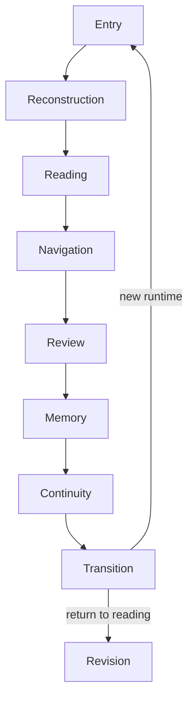
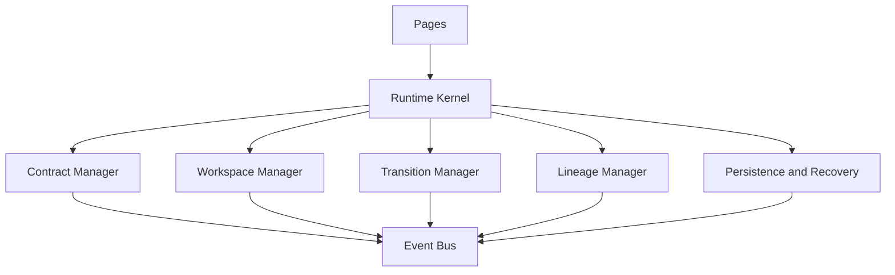

# M1-W1 Runtime Inventory

Status: **Frozen**  
Registry: `content/registry/runtime-modules.json`  
Audit baseline: `19e7a73174a1c7dd84c419c50e1d880331038a7a`

This inventory closes the Runtime module list and canonical path contract. It does not declare the whole M1 milestone Freeze Ready. After this point, Runtime changes are limited to Kernel Migration, Contract Closure, and Bug Fix. No new Runtime Stage may be added.

## T01 — Runtime Module List

### Closed stage sequence

| Order | Module | Canonical server boundary | Role |
|---:|---|---|---|
| 1 | Entry | `functions/runtime/entry/` | Accept and normalize the reported runtime entry. |
| 2 | Reconstruction | `functions/runtime/reconstruction/` | Reconstruct formation structure from the entry contract. |
| 3 | Reading | `functions/runtime/reading/` | Produce evidence-bounded reality reading. |
| 4 | Navigation | `functions/runtime/navigation/` | Generate and validate navigation paths. |
| 5 | Review | `functions/runtime/review/` | Review navigation outcome and select the next runtime state. |
| 6 | Memory | `functions/runtime/memory/` | Convert reviewed outcome into bounded runtime memory. |
| 7 | Continuity | `functions/runtime/continuity/` | Determine continuation, revision, or new-entry handoff. |

The seven entries above are the complete Runtime Stage set. Transition, Revision, Lineage, Persistence, Kernel, Workspace, and Recovery are services or boundaries, not additional stages.

### Runtime services and shared contracts

| Module | Canonical boundary | Classification |
|---|---|---|
| Transition | `assets/js/runtime/kernel/transition-manager.js`; `assets/js/modules/runtime-transition-engine.js` | Kernel facade + browser implementation |
| Revision | `assets/js/modules/runtime-revision-initializer.js` | Browser service |
| Lineage | `assets/js/runtime/kernel/lineage-manager.js`; `assets/js/modules/runtime-lineage.js` | Kernel facade + browser implementation |
| Persistence | `assets/js/runtime/kernel/persistence-manager.js`; `assets/js/modules/runtime-persistence.js` | Kernel facade + browser implementation |
| Kernel | `assets/js/runtime/index.js`; `assets/js/runtime/kernel/` | Public browser boundary |
| Workspace | `assets/js/runtime/kernel/workspace-manager.js`; `assets/js/modules/runtime-workspace*.js` | Kernel facade + browser implementation/state |
| Recovery | `assets/js/runtime/kernel/recovery-manager.js` | Kernel service |
| Contract Manager | `assets/js/runtime/kernel/contract-manager.js` | Kernel service |
| Event Bus | `assets/js/runtime/kernel/event-bus.js` | Kernel service |
| Schema Registry | `functions/runtime/shared/schema-registry.js`; `assets/js/core/schema-registry.js` | Cross-runtime aligned contract |
| Formation Grammar | `functions/runtime/formation/grammar-registry.js` | Domain registry used by Reconstruction |
| Runtime Locales | `functions/runtime/locales/` | Server support module |

## T02 — Duplicate Implementation Audit

The post-migration audit found no exact Runtime implementation duplicates.

The similarly named files under `assets/js/runtime/kernel/` and `assets/js/modules/` are intentional facade/implementation pairs. Pages consume `assets/js/runtime/index.js`; managers delegate to the existing implementation modules. They must not evolve into two independent authorities.

The browser and server schema registries are an aligned cross-runtime pair. They may contain platform-specific surfaces, but identifiers shared across runtimes must remain aligned.

The following former browser-Kernel locations are forbidden and checked automatically:

```text
functions/runtime/index.js
functions/runtime/kernel.js
functions/runtime/kernel/
functions/runtime/contract-manager.js
functions/runtime/event-bus.js
functions/runtime/lineage-manager.js
functions/runtime/persistence-manager.js
functions/runtime/recovery-manager.js
functions/runtime/transition-manager.js
functions/runtime/workspace-manager.js
```

## T03 — Canonical Runtime Paths

| Path family | Authority |
|---|---|
| `functions/runtime/<stage>/` | Server-side stage rules, contracts, builders, and provider routing |
| `functions/runtime/shared/` | Server-side shared Runtime contracts |
| `functions/runtime/formation/` | Frozen formation grammar registry; not a stage |
| `functions/runtime/locales/` | Runtime-specific server locale support |
| `assets/js/runtime/index.js` | Only public browser Kernel entry |
| `assets/js/runtime/kernel/` | Browser Kernel and manager facades |
| `assets/js/modules/runtime-*.js` | Browser implementation and state modules behind Kernel managers |
| `assets/js/pages/` | UI consumers; must not reimplement Runtime contracts |

New public imports from pages must use `assets/js/runtime/index.js` when a Kernel capability exists. Direct page imports of transition, lineage, persistence, or workspace implementation modules are prohibited.

## T04 — Runtime Dependency Map



The browser orchestration boundary is:



Cross-cutting dependencies do not alter the stage sequence: Schema Registry constrains contracts, Formation Grammar supports Reconstruction, Runtime Locales support Navigation output, and Lineage observes history without becoming a stage.

## Freeze Rules

1. The seven-stage sequence is closed.
2. A new directory or label must not be interpreted as a Runtime Stage without reopening the M1 contract.
3. Pages must consume Kernel capabilities through `assets/js/runtime/index.js`.
4. Manager facades and implementation modules must not duplicate business authority.
5. Historical records are append-only; revision must not overwrite prior Runtime history.
6. `npm run check:runtime-inventory` must pass before Runtime changes are merged.

